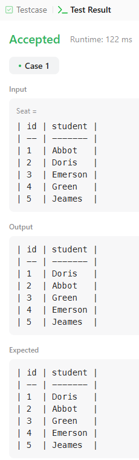
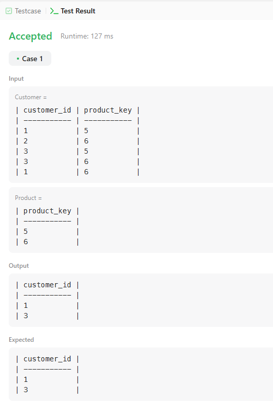
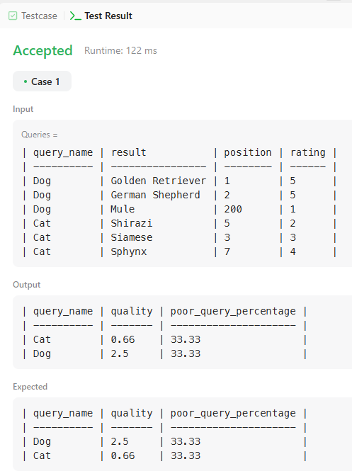

# 626

#### Write a solution to swap the seat id of every two consecutive students. If the number of students is odd, the id of the last student is not swapped. Return the result table ordered by id in ascending order.

```sql
SELECT 
    CASE 
        WHEN id % 2 = 1 AND id = (SELECT MAX(id) FROM Seat) THEN id
        WHEN id % 2 = 1 THEN id + 1
        ELSE id - 1
    END AS id,
    student
FROM 
    Seat
ORDER BY 
    id ASC;
```



# 1045

#### Write a solution to report the customer ids from the Customer table that bought all the products in the Product table. Return the result table in any order.

```sql
SELECT customer_id
FROM Customer
GROUP BY customer_id
HAVING COUNT(DISTINCT product_key) = (SELECT COUNT(*) FROM Product)
```



# 1211

#### Write a solution to find each query_name, the quality and poor_query_percentage. Both quality and poor_query_percentage should be rounded to 2 decimal places.

```sql
SELECT 
    query_name,
    ROUND(AVG(rating * 1.0 / position), 2) AS quality,
    ROUND(SUM(CASE WHEN rating < 3 THEN 1 ELSE 0 END) * 100.0 / COUNT(*), 2) AS poor_query_percentage
FROM Queries
WHERE query_name IS NOT NULL
GROUP BY query_name;
```

