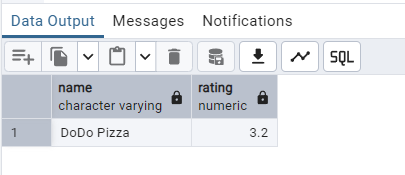
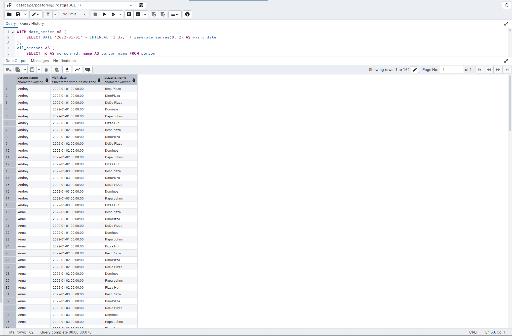
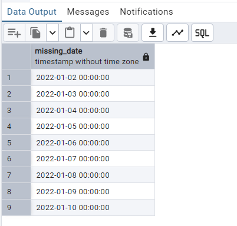
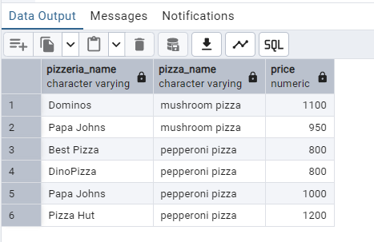
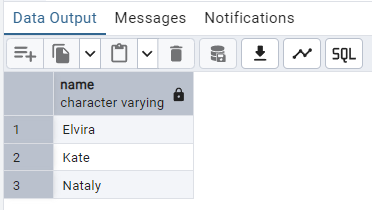
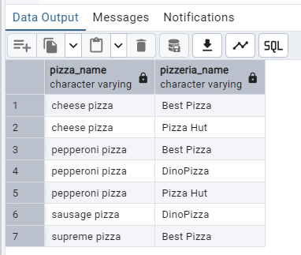
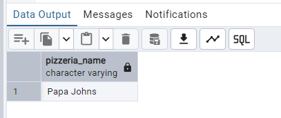
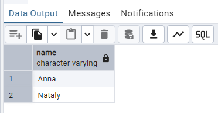
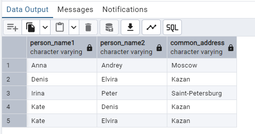

## Day 2

#### Exercise 00 - Move to the LEFT, move to the RIGHT

Please write a SQL statement which returns a list of pizzerias names with corresponding rating value which have not been visited by persons.

```sql
SELECT p.name, p.rating
FROM pizzeria p
LEFT JOIN person_visits pv ON p.id = pv.pizzeria_id
WHERE pv.pizzeria_id IS NULL;
```



#### Exercise 01 - Find data gaps

Please write a SQL statement which returns the missing days from 1st to 10th of January 2022 (including all days) for visits  of persons with identifiers 1 or 2 (it means days missed by both). Please order by visiting days in ascending mode. The sample of data with column name is presented below.

```sql
WITH date_series AS (
    SELECT DATE '2022-01-01' + INTERVAL '1 day' * generate_series(0, 9) AS missing_date
),
person_visits_filtered AS (
    SELECT DISTINCT visit_date, person_id
    FROM person_visits
    WHERE person_id IN (1, 2)
),
grouped_visits AS (
    SELECT visit_date
    FROM person_visits_filtered
    GROUP BY visit_date
    HAVING COUNT(DISTINCT person_id) = 2  -- Дни, когда оба посещали
)
SELECT d.missing_date
FROM date_series d
LEFT JOIN grouped_visits v ON d.missing_date = v.visit_date
WHERE v.visit_date IS NULL
ORDER BY d.missing_date;
```


#### Exercise 02 - FULL means ‘completely filled’

Please write a SQL statement that returns a whole list of person names visited (or not visited) pizzerias during the period from 1st to 3rd of January 2022 from one side and the whole list of pizzeria names which have been visited (or not visited) from the other side. The data sample with needed column names is presented below. Please pay attention to the substitution value ‘-’ for `NULL` values in `person_name` and `pizzeria_name` columns. Please also add ordering for all 3 columns.

```sql
WITH date_series AS (
    SELECT DATE '2022-01-01' + INTERVAL '1 day' * generate_series(0, 2) AS visit_date
),
all_persons AS (
    SELECT id AS person_id, name AS person_name FROM person
),
all_pizzerias AS (
    SELECT id AS pizzeria_id, name AS pizzeria_name FROM pizzeria
),
full_combinations AS (
    SELECT 
        p.person_name, 
        d.visit_date, 
        z.pizzeria_name
    FROM all_persons p
    CROSS JOIN date_series d
    CROSS JOIN all_pizzerias z
),
actual_visits AS (
    SELECT 
        v.visit_date, 
        p.name AS person_name, 
        z.name AS pizzeria_name
    FROM person_visits v
    JOIN person p ON v.person_id = p.id
    JOIN pizzeria z ON v.pizzeria_id = z.id
    WHERE v.visit_date BETWEEN '2022-01-01' AND '2022-01-03'
),
final_result AS (
    SELECT 
        COALESCE(f.person_name, '-') AS person_name,
        f.visit_date,
        COALESCE(f.pizzeria_name, '-') AS pizzeria_name
    FROM full_combinations f
    LEFT JOIN actual_visits a 
        ON f.person_name = a.person_name 
        AND f.visit_date = a.visit_date 
        AND f.pizzeria_name = a.pizzeria_name
    WHERE a.visit_date IS NULL
    UNION ALL
    SELECT 
        person_name,
        visit_date,
        pizzeria_name
    FROM actual_visits
)
SELECT * 
FROM final_result
ORDER BY person_name, visit_date, pizzeria_name;
```


#### Exercise 03 - Reformat to CTE

Let’s return back to Exercise #01, please rewrite your SQL by using the CTE (Common Table Expression) pattern. Please move into the CTE part of your "day generator". The result should be similar like in Exercise #01

```sql
WITH date_series AS (
    SELECT DATE '2022-01-01' + INTERVAL '1 day' * generate_series(0, 9) AS missing_date
),
person_visits_filtered AS (
    SELECT DISTINCT visit_date, person_id
    FROM person_visits
    WHERE person_id IN (1, 2)
),
grouped_visits AS (
    SELECT visit_date
    FROM person_visits_filtered
    GROUP BY visit_date
    HAVING COUNT(DISTINCT person_id) = 2
),
missing_days AS (
    SELECT d.missing_date
    FROM date_series d
    LEFT JOIN grouped_visits v ON d.missing_date = v.visit_date
    WHERE v.visit_date IS NULL
)
SELECT missing_date 
FROM missing_days
ORDER BY missing_date;
```



#### Exercise 04 - Find favourite pizzas

Find full information about all possible pizzeria names and prices to get mushroom or pepperoni pizzas. Please sort the result by pizza name and pizzeria name then. The result of sample data is below (please use the same column names in your SQL statement).

```sql
SELECT 
    pz.name AS pizzeria_name,
    m.pizza_name,
    m.price
FROM menu m
JOIN pizzeria pz ON m.pizzeria_id = pz.id
WHERE LOWER(m.pizza_name) LIKE '%mushroom%'
   OR LOWER(m.pizza_name) LIKE '%pepperoni%'
ORDER BY m.pizza_name, pz.name;
```



#### Exercise 05 - Investigate Person Data

Find names of all female persons older than 25 and order the result by name. The sample of output is presented below.

```sql
SELECT name
FROM person
WHERE gender = 'female' AND age > 25
ORDER BY name;
```



#### Exercise 06 - favourite pizzas for Denis and Anna

Please find all pizza names (and corresponding pizzeria names using `menu` table) that Denis or Anna ordered. Sort a result by both columns. The sample of output is presented below.

```sql
SELECT m.pizza_name, p.name AS pizzeria_name
FROM menu m
JOIN person_order po ON m.id = po.menu_id
JOIN person per ON po.person_id = per.id
JOIN pizzeria p ON m.pizzeria_id = p.id
WHERE per.name IN ('Denis', 'Anna')
ORDER BY m.pizza_name, p.name;
```



#### Exercise 07 - Cheapest pizzeria for Dmitriy

Please find the name of pizzeria Dmitriy visited on January 8, 2022 and could eat pizza for less than 800 rubles.

```sql
SELECT p.name AS pizzeria_name
FROM pizzeria p
JOIN person_visits pv ON p.id = pv.pizzeria_id
JOIN person per ON pv.person_id = per.id
JOIN menu m ON p.id = m.pizzeria_id
WHERE per.name = 'Dmitriy'
  AND pv.visit_date = '2022-01-08'
  AND m.price < 800;
```



#### Exercise 08 - Continuing to research data

Please find the names of all males from Moscow or Samara cities who orders either pepperoni or mushroom pizzas (or both) . Please order the result by person name in descending mode. The sample of output is presented below.

```sql
SELECT per.name
FROM person per
JOIN person_order po ON per.id = po.person_id
JOIN menu m ON po.menu_id = m.id
JOIN pizzeria p ON m.pizzeria_id = p.id
WHERE per.gender = 'male'
  AND (per.address IN ('Moscow', 'Samara'))
  AND (m.pizza_name = 'pepperoni pizza' OR m.pizza_name = 'mushroom pizza')
ORDER BY per.name DESC;
```


#### Exercise 09 - Who loves cheese and pepperoni?

Please find the names of all females who ordered both pepperoni and cheese pizzas (at any time and in any pizzerias). Make sure that the result is ordered by person name. The sample of data is presented below.

```sql
SELECT per.name
FROM person per
JOIN person_order po ON per.id = po.person_id
JOIN menu m ON po.menu_id = m.id
WHERE per.gender = 'female'
  AND m.pizza_name IN ('pepperoni pizza', 'cheese pizza')
GROUP BY per.name
HAVING COUNT(DISTINCT m.pizza_name) = 2
ORDER BY per.name;
```



#### Exercise 10 - Find persons from one city

Please find the names of persons who live on the same address. Make sure that the result is ordered by 1st person, 2nd person's name and common address. The  data sample is presented below. Please make sure your column names are corresponding column names below.

```sql
SELECT p1.name AS person_name1, p2.name AS person_name2, p1.address AS common_address
FROM person p1
JOIN person p2 ON p1.address = p2.address AND p1.id < p2.id
ORDER BY p1.name, p2.name, p1.address;
```

