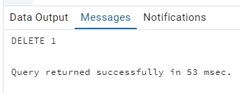

## Day 3

#### Exercise 00 - Let’s find appropriate prices for Kate

Please write a SQL statement which returns a list of pizza names, pizza prices, pizzerias names and dates of visit for Kate and for prices in range from 800 to 1000 rubles. Please sort by pizza, price and pizzeria names.

```sql
SELECT DISTINCT
    m.pizza_name,
    m.price,
    pz.name AS pizzeria_name,
    pv.visit_date
FROM person AS pe
JOIN person_visits AS pv ON pe.id = pv.person_id
JOIN pizzeria AS pz ON pv.pizzeria_id = pz.id
JOIN menu AS m ON pz.id = m.pizzeria_id
WHERE pe.name = 'Kate'
    AND m.price BETWEEN 800 AND 1000
ORDER BY m.pizza_name, m.price, pz.name;
```


#### Exercise 01 - Let’s find forgotten menus

Please find all menu identifiers which are not ordered by anyone. The result should be sorted by identifiers.

```sql
SELECT m.id AS menu_id
FROM menu AS m
LEFT JOIN person_order AS po ON m.id = po.menu_id
WHERE po.menu_id IS NULL
ORDER BY m.id;
```


#### Exercise 02 - Let’s find forgotten pizza and pizzerias

Please use SQL statement from Exercise #01 and show pizza names from pizzeria which are not ordered by anyone, including corresponding prices also. The result should be sorted by pizza name and price. The sample of output data is presented below.

```sql
SELECT m.pizza_name, m.price, pz.name AS pizzeria_name
FROM menu AS m
JOIN pizzeria AS pz ON m.pizzeria_id = pz.id
LEFT JOIN person_order AS po ON m.id = po.menu_id
WHERE po.menu_id IS NULL
ORDER BY m.pizza_name, m.price;
```


#### Exercise 03 - Let’s compare visits

Please find pizzerias that have been visited more often by women or by men. For any SQL operators with sets save duplicates (UNION ALL, EXCEPT ALL, INTERSECT ALL constructions). Please sort a result by the pizzeria name. The data sample is provided below.

```sql
SELECT pz.name AS pizzeria_name
FROM (
    -- Пиццерии, которые женщины посещали чаще
    SELECT pv.pizzeria_id
    FROM person_visits AS pv
    JOIN person AS pe ON pv.person_id = pe.id
    WHERE pe.gender = 'female'
    EXCEPT ALL
    -- Исключаем пиццерии, которые мужчины посещали не реже
    SELECT pv.pizzeria_id
    FROM person_visits AS pv
    JOIN person AS pe ON pv.person_id = pe.id
    WHERE pe.gender = 'male'
    
    UNION ALL
    
    -- Пиццерии, которые мужчины посещали чаще
    SELECT pv.pizzeria_id
    FROM person_visits AS pv
    JOIN person AS pe ON pv.person_id = pe.id
    WHERE pe.gender = 'male'
    EXCEPT ALL
    -- Исключаем пиццерии, которые женщины посещали не реже
    SELECT pv.pizzeria_id
    FROM person_visits AS pv
    JOIN person AS pe ON pv.person_id = pe.id
    WHERE pe.gender = 'female'
) AS filtered_pizzerias
JOIN pizzeria AS pz ON filtered_pizzerias.pizzeria_id = pz.id
ORDER BY pz.name;
```


#### Exercise 04 - Let’s compare orders

Please find a union of pizzerias that have orders either from women or  from men. Other words, you should find a set of pizzerias names have been ordered by females only and make "UNION" operation with set of pizzerias names have been ordered by males only. Please be aware with word “only” for both genders. For any SQL operators with sets don’t save duplicates (`UNION`, `EXCEPT`, `INTERSECT`).  Please sort a result by the pizzeria name. The data sample is provided below.

```sql
WITH female_pizzerias AS (
    SELECT DISTINCT m.pizzeria_id
    FROM person_order AS po
    JOIN menu AS m ON po.menu_id = m.id
    JOIN person AS pe ON po.person_id = pe.id
    WHERE pe.gender = 'female'
),
male_pizzerias AS (
    SELECT DISTINCT m.pizzeria_id
    FROM person_order AS po
    JOIN menu AS m ON po.menu_id = m.id
    JOIN person AS pe ON po.person_id = pe.id
    WHERE pe.gender = 'male'
)
SELECT pz.name AS pizzeria_name
FROM pizzeria AS pz
WHERE pz.id IN (
    SELECT pizzeria_id FROM female_pizzerias
    EXCEPT
    SELECT pizzeria_id FROM male_pizzerias
)
UNION
SELECT pz.name AS pizzeria_name
FROM pizzeria AS pz
WHERE pz.id IN (
    SELECT pizzeria_id FROM male_pizzerias
    EXCEPT
    SELECT pizzeria_id FROM female_pizzerias
)
ORDER BY pizzeria_name;
```


#### Exercise 05 - Visited but did not make any order

Please write a SQL statement which returns a list of pizzerias which Andrey visited but did not make any orders. Please order by the pizzeria name. The sample of data is provided below.

```sql
SELECT DISTINCT pz.name AS pizzeria_name
FROM person_visits AS pv
JOIN pizzeria AS pz ON pv.pizzeria_id = pz.id
JOIN person AS pe ON pv.person_id = pe.id
WHERE pe.name = 'Andrey'
AND pz.id NOT IN (
    SELECT DISTINCT m.pizzeria_id
    FROM person_order AS po
    JOIN menu AS m ON po.menu_id = m.id
    WHERE po.person_id = pe.id
)
ORDER BY pz.name;
```


#### Exercise 06 - Find price-similarity pizzas

Please find the same pizza names who have the same price, but from different pizzerias. Make sure that the result is ordered by pizza name. The sample of data is presented below. Please make sure your column names are corresponding column names below.

```sql
SELECT 
    m1.pizza_name,
    pz1.name AS pizzeria_name_1,
    pz2.name AS pizzeria_name_2,
    m1.price
FROM menu AS m1
JOIN menu AS m2 ON m1.pizza_name = m2.pizza_name 
                AND m1.price = m2.price 
                AND m1.pizzeria_id < m2.pizzeria_id
JOIN pizzeria AS pz1 ON m1.pizzeria_id = pz1.id
JOIN pizzeria AS pz2 ON m2.pizzeria_id = pz2.id
ORDER BY m1.pizza_name;
```


#### Exercise 07 - Let’s cook a new type of pizza

Please register a new pizza with name “greek pizza” (use id = 19) with price 800 rubles in “Dominos” restaurant (pizzeria_id = 2).
**Warning**: this exercise will probably be the cause  of changing data in the wrong way. Actually, you can restore the initial database model with data from the link in the “Rules of the day” section.

```sql
INSERT INTO menu (id, pizzeria_id, pizza_name, price)
VALUES (19, 2, 'greek pizza', 800);
```


#### Exercise 08 - Let’s cook a new type of pizza with more dynamics

Please register a new pizza with name “sicilian pizza” (whose id should be calculated by formula is “maximum id value + 1”) with a price of 900 rubles in “Dominos” restaurant (please use internal query to get identifier of pizzeria).
**Warning**: this exercise will probably be the cause  of changing data in the wrong way. Actually, you can restore the initial database model with data from the link in the “Rules of the day” section and replay script from Exercise 07.

```sql
INSERT INTO menu (id, pizzeria_id, pizza_name, price)
VALUES (
    (SELECT MAX(id) + 1 FROM menu),  -- Вычисляем новый id
    (SELECT id FROM pizzeria WHERE name = 'Dominos'),  -- Получаем id пиццерии "Dominos"
    'sicilian pizza',
    900
);
```


#### Exercise 09 - New pizza means new visits

Please register new visits into Dominos restaurant from Denis and Irina on 24th of February 2022.
**Warning**: this exercise will probably be the cause  of changing data in the wrong way. Actually, you can restore the initial database model with data from the link in the “Rules of the day” section and replay script from Exercises 07 and 08..

```sql
INSERT INTO person_visits (id, person_id, pizzeria_id, visit_date)
VALUES 
((SELECT MAX(id) + 1 FROM person_visits), (SELECT id FROM person WHERE name = 'Denis'), (SELECT id FROM pizzeria WHERE name = 'Dominos'), '2022-02-24'),
((SELECT MAX(id) + 2 FROM person_visits), (SELECT id FROM person WHERE name = 'Irina'), (SELECT id FROM pizzeria WHERE name = 'Dominos'), '2022-02-24');
```


#### Exercise 10 - New visits means new orders

Please register new orders from Denis and Irina on 24th of February 2022 for the new menu with “sicilian pizza”.
**Warning**: this exercise will probably be the cause  of changing data in the wrong way. Actually, you can restore the initial database model with data from the link in the “Rules of the day” section and replay script from Exercises 07 , 08 and 09.

```sql
INSERT INTO person_order (id, person_id, menu_id, order_date)
VALUES 
((SELECT MAX(id) + 1 FROM person_order), (SELECT id FROM person WHERE name = 'Denis'), (SELECT id FROM menu WHERE pizza_name = 'sicilian pizza'), '2022-02-24'),
((SELECT MAX(id) + 2 FROM person_order), (SELECT id FROM person WHERE name = 'Irina'), (SELECT id FROM menu WHERE pizza_name = 'sicilian pizza'), '2022-02-24');
```


#### Exercise 11 - “Improve” a price for clients

Please change the price for “greek pizza” on -10% from the current value.
**Warning**: this exercise will probably be the cause  of changing data in the wrong way. Actually, you can restore the initial database model with data from the link in the “Rules of the day” section and replay script from Exercises 07 , 08 ,09 and 10.

```sql
UPDATE menu
SET price = price * 0.9
WHERE pizza_name = 'greek pizza';
```


#### Exercise 12 - New orders are coming!

Please register new orders from all persons for “greek pizza” on 25th of February 2022.
**Warning**: this exercise will probably be the cause  of changing data in the wrong way. Actually, you can restore the initial database model with data from the link in the “Rules of the day” section and replay script from Exercises 07 , 08 ,09 , 10 and 11.

```sql
INSERT INTO person_order (id, person_id, menu_id, order_date)
SELECT 
    (SELECT COALESCE(MAX(id), 0) + ROW_NUMBER() OVER () FROM person_order) + (SELECT COUNT(*) FROM person_order),  
    p.id,
    (SELECT id FROM menu WHERE pizza_name = 'greek pizza'),
    '2022-02-25'
FROM person p
WHERE NOT EXISTS (SELECT 1 FROM person_order); 
```


#### Exercise 13 - Money back to our customers

Please write 2 SQL (DML) statements that delete all new orders from exercise #12 based on order date. Then delete “greek pizza” from the menu. 
**Warning**: this exercise will probably be the cause  of changing data in the wrong way. Actually, you can restore the initial database model with data from the link in the “Rules of the day” section and replay script from Exercises 07 , 08 ,09 , 10 , 11, 12 and 13.

```sql
DELETE FROM person_order
WHERE menu_id = (SELECT id FROM menu WHERE pizza_name = 'greek pizza')
  AND order_date = '2022-02-25';
DELETE FROM menu
WHERE pizza_name = 'greek pizza';
```

