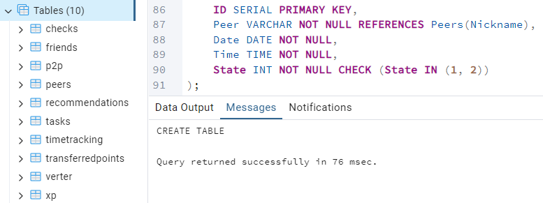
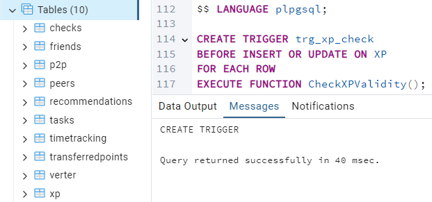
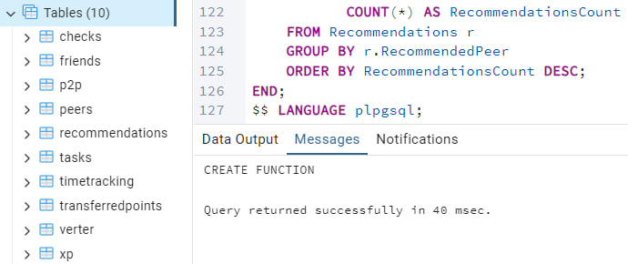
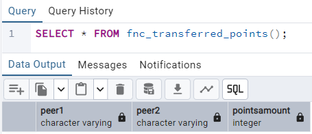
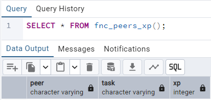
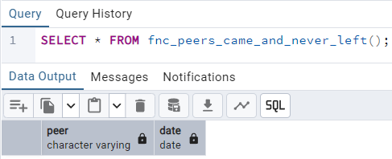
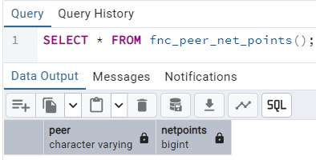

## Zachet

### Task 1: Database Creation
- **`part1.sql`** Script that creates the database and all the tables described 
  in the 
  logical view of the database.

```sql
-- Удалим схему, если она существует (для повторного запуска)
DROP SCHEMA IF EXISTS public CASCADE;
CREATE SCHEMA public;

-- 1. Перечисление для статуса проверки
CREATE TYPE check_status AS ENUM ('Start', 'Success', 'Failure');

-- 2. Таблица Peers — участники
CREATE TABLE Peers (
    Nickname VARCHAR PRIMARY KEY,
    Birthday DATE NOT NULL
);

-- 3. Таблица Tasks — задания
CREATE TABLE Tasks (
    Title VARCHAR PRIMARY KEY,
    ParentTask VARCHAR REFERENCES Tasks(Title),
    MaxXP INT NOT NULL CHECK (MaxXP >= 0)
);

-- 4. Таблица Checks — факт проверки задания
CREATE TABLE Checks (
    ID SERIAL PRIMARY KEY,
    Peer VARCHAR NOT NULL REFERENCES Peers(Nickname),
    Task VARCHAR NOT NULL REFERENCES Tasks(Title),
    Date DATE NOT NULL
);

-- 5. Таблица P2P — peer-to-peer проверки
CREATE TABLE P2P (
    ID SERIAL PRIMARY KEY,
    CheckID INT NOT NULL REFERENCES Checks(ID),
    CheckingPeer VARCHAR NOT NULL REFERENCES Peers(Nickname),
    State check_status NOT NULL,
    Time TIME NOT NULL,
    -- Ограничение: один проверяющий может начать только одну P2P на одну проверку
    UNIQUE (CheckID, CheckingPeer, State)
);

-- 6. Таблица Verter — проверка от бота Verter
CREATE TABLE Verter (
    ID SERIAL PRIMARY KEY,
    CheckID INT NOT NULL REFERENCES Checks(ID),
    State check_status NOT NULL,
    Time TIME NOT NULL
);

-- 7. Таблица TransferredPoints — переданные "пойнты"
CREATE TABLE TransferredPoints (
    ID SERIAL PRIMARY KEY,
    CheckingPeer VARCHAR NOT NULL REFERENCES Peers(Nickname),
    CheckedPeer VARCHAR NOT NULL REFERENCES Peers(Nickname),
    PointsAmount INT NOT NULL CHECK (PointsAmount >= 0),
    -- Уникальная пара (но не симметричная!)
    UNIQUE (CheckingPeer, CheckedPeer)
);

-- 8. Таблица Friends — дружба (симметричная, но храним каждую пару один раз)
CREATE TABLE Friends (
    ID SERIAL PRIMARY KEY,
    Peer1 VARCHAR NOT NULL REFERENCES Peers(Nickname),
    Peer2 VARCHAR NOT NULL REFERENCES Peers(Nickname),
    CHECK (Peer1 < Peer2) -- чтобы избежать дублей: (A,B) и (B,A)
);

-- 9. Таблица Recommendations — рекомендации
CREATE TABLE Recommendations (
    ID SERIAL PRIMARY KEY,
    Peer VARCHAR NOT NULL REFERENCES Peers(Nickname),
    RecommendedPeer VARCHAR NOT NULL REFERENCES Peers(Nickname),
    CHECK (Peer != RecommendedPeer)
);

-- 10. Таблица XP — заработанный опыт
CREATE TABLE XP (
    ID SERIAL PRIMARY KEY,
    CheckID INT NOT NULL REFERENCES Checks(ID),
    XPAmount INT NOT NULL CHECK (XPAmount >= 0)
);

-- 11. Таблица TimeTracking — посещения кампуса
-- State: 1 — пришёл, 2 — ушёл
CREATE TABLE TimeTracking (
    ID SERIAL PRIMARY KEY,
    Peer VARCHAR NOT NULL REFERENCES Peers(Nickname),
    Date DATE NOT NULL,
    Time TIME NOT NULL,
    State INT NOT NULL CHECK (State IN (1, 2))
);
```


### Task 2: Changing Data
- **`part2.sql`** Script that includes procedures for adding P2P check, 
  adding checking by Verter, and triggers for changing records in the P2P and XP tables.

```sql
-- 1. Процедура: добавление P2P-проверки
CREATE OR REPLACE PROCEDURE AddP2PCheck(
    checked_peer VARCHAR,
    checking_peer VARCHAR,
    task_title VARCHAR,
    p2p_state check_status,
    check_time TIME
)
LANGUAGE plpgsql
AS $$
DECLARE
    check_id INT;
BEGIN
    -- Если это начало проверки (Start)
    IF p2p_state = 'Start' THEN
        -- Создаём новую запись в Checks
        INSERT INTO Checks (Peer, Task, Date)
        VALUES (checked_peer, task_title, CURRENT_DATE)
        RETURNING ID INTO check_id;

        -- Добавляем запись в P2P со статусом Start
        INSERT INTO P2P (CheckID, CheckingPeer, State, Time)
        VALUES (check_id, checking_peer, 'Start', check_time);

        -- Увеличиваем PointsAmount в TransferredPoints
        INSERT INTO TransferredPoints (CheckingPeer, CheckedPeer, PointsAmount)
        VALUES (checking_peer, checked_peer, 1)
        ON CONFLICT (CheckingPeer, CheckedPeer)
        DO UPDATE SET PointsAmount = TransferredPoints.PointsAmount + 1;

    -- Если это завершение проверки (Success/Failure)
    ELSE
        -- Находим последнюю P2P-запись со статусом Start для этой пары и задачи
        SELECT c.ID INTO check_id
        FROM Checks c
        JOIN P2P p ON c.ID = p.CheckID
        WHERE c.Peer = checked_peer
          AND c.Task = task_title
          AND p.CheckingPeer = checking_peer
          AND p.State = 'Start'
          AND c.Date = CURRENT_DATE
        ORDER BY p.Time DESC
        LIMIT 1;

        IF check_id IS NULL THEN
            RAISE EXCEPTION 'No active P2P check found to complete';
        END IF;

        -- Добавляем запись завершения
        INSERT INTO P2P (CheckID, CheckingPeer, State, Time)
        VALUES (check_id, checking_peer, p2p_state, check_time);
    END IF;
END;
$$;

-- 2. Процедура: добавление проверки Verter
CREATE OR REPLACE PROCEDURE AddVerterCheck(
    checked_peer VARCHAR,
    task_title VARCHAR,
    verter_state check_status,
    check_time TIME
)
LANGUAGE plpgsql
AS $$
DECLARE
    check_id INT;
BEGIN
    -- Ищем проверку, у которой P2P уже завершена (есть Success)
    SELECT c.ID INTO check_id
    FROM Checks c
    JOIN P2P p ON c.ID = p.CheckID
    WHERE c.Peer = checked_peer
      AND c.Task = task_title
      AND p.State = 'Success'
    ORDER BY p.Time DESC
    LIMIT 1;

    IF check_id IS NULL THEN
        RAISE EXCEPTION 'No successful P2P check found for Verter verification';
    END IF;

    -- Добавляем запись Verter
    INSERT INTO Verter (CheckID, State, Time)
    VALUES (check_id, verter_state, check_time);
END;
$$;

-- 3. Триггер: проверка корректности XP (не больше MaxXP)
CREATE OR REPLACE FUNCTION CheckXPValidity()
RETURNS TRIGGER AS $$
DECLARE
    max_xp INT;
BEGIN
    SELECT t.MaxXP INTO max_xp
    FROM XP x
    JOIN Checks c ON x.CheckID = c.ID
    JOIN Tasks t ON c.Task = t.Title
    WHERE x.ID = NEW.ID;

    -- Если только что вставляем, то используем NEW.CheckID
    SELECT t.MaxXP INTO max_xp
    FROM Checks c
    JOIN Tasks t ON c.Task = t.Title
    WHERE c.ID = NEW.CheckID;

    IF NEW.XPAmount > max_xp THEN
        RAISE EXCEPTION 'XPAmount (%) exceeds MaxXP (%) for this task', NEW.XPAmount, max_xp;
    END IF;

    RETURN NEW;
END;
$$ LANGUAGE plpgsql;

CREATE TRIGGER trg_xp_check
BEFORE INSERT OR UPDATE ON XP
FOR EACH ROW
EXECUTE FUNCTION CheckXPValidity();
```



### Task 3: Getting Data
- **`part3.sql`** Script that includes functions for returning the 
  TransferredPoints table in a more human-readable form, returning a table of the form: username, name of the checked task, number of XP received, finding the peers who have not left campus for the whole day, calculating the change in the number of peer points of each peer using the TransferredPoints table, and more.

```sql
-- 1. Человекочитаемая таблица TransferredPoints: кто кому сколько передал
CREATE OR REPLACE FUNCTION fnc_transferred_points()
RETURNS TABLE (
    Peer1 VARCHAR,
    Peer2 VARCHAR,
    PointsAmount INT
) AS $$
BEGIN
    RETURN QUERY
    SELECT tp.CheckingPeer AS Peer1,
           tp.CheckedPeer  AS Peer2,
           tp.PointsAmount
    FROM TransferredPoints tp;
END;
$$ LANGUAGE plpgsql;


-- 2. Таблица: Пир, Задание, Полученный XP
CREATE OR REPLACE FUNCTION fnc_peers_xp()
RETURNS TABLE (
    Peer VARCHAR,
    Task VARCHAR,
    XP INT
) AS $$
BEGIN
    RETURN QUERY
    SELECT p.Nickname AS Peer,
           t.Title    AS Task,
           x.XPAmount AS XP
    FROM XP x
    JOIN Checks c ON x.CheckID = c.ID
    JOIN Peers p ON c.Peer = p.Nickname
    JOIN Tasks t ON c.Task = t.Title;
END;
$$ LANGUAGE plpgsql;


-- 3. Пиры, которые НЕ ПОКИДАЛИ кампус весь день (остались на ночь)
-- То есть: есть запись State=1 (пришёл), но НЕТ State=2 (ушёл) за ту же дату
CREATE OR REPLACE FUNCTION fnc_peers_came_and_never_left()
RETURNS TABLE (
    Peer VARCHAR,
    Date DATE
) AS $$
BEGIN
    RETURN QUERY
    SELECT t1.Peer, t1.Date
    FROM TimeTracking t1
    WHERE t1.State = 1
      AND NOT EXISTS (
          SELECT 1
          FROM TimeTracking t2
          WHERE t2.Peer = t1.Peer
            AND t2.Date = t1.Date
            AND t2.State = 2
      );
END;
$$ LANGUAGE plpgsql;


-- 4. Чистое изменение очков для каждого пира:
-- (получено от других) - (отдано другим)
CREATE OR REPLACE FUNCTION fnc_peer_net_points()
RETURNS TABLE (
    Peer VARCHAR,
    NetPoints BIGINT
) AS $$
BEGIN
    RETURN QUERY
    WITH points_received AS (
        SELECT CheckedPeer AS Peer, SUM(PointsAmount) AS Received
        FROM TransferredPoints
        GROUP BY CheckedPeer
    ),
    points_given AS (
        SELECT CheckingPeer AS Peer, SUM(PointsAmount) AS Given
        FROM TransferredPoints
        GROUP BY CheckingPeer
    ),
    all_peers AS (
        SELECT Nickname AS Peer FROM Peers
    )
    SELECT ap.Peer,
           COALESCE(r.Received, 0) - COALESCE(g.Given, 0) AS NetPoints
    FROM all_peers ap
    LEFT JOIN points_received r ON ap.Peer = r.Peer
    LEFT JOIN points_given g ON ap.Peer = g.Peer
    ORDER BY NetPoints DESC;
END;
$$ LANGUAGE plpgsql;


-- 5. Дополнительно: Пиры, у которых больше всего успешных P2P-проверок (как проверяющие)
CREATE OR REPLACE FUNCTION fnc_top_checking_peers()
RETURNS TABLE (
    Peer VARCHAR,
    SuccessfulChecks BIGINT
) AS $$
BEGIN
    RETURN QUERY
    SELECT p.CheckingPeer AS Peer,
           COUNT(*) AS SuccessfulChecks
    FROM P2P p
    WHERE p.State = 'Success'
    GROUP BY p.CheckingPeer
    ORDER BY SuccessfulChecks DESC;
END;
$$ LANGUAGE plpgsql;


-- 6. Дополнительно: Пиры, рекомендованные чаще всего
CREATE OR REPLACE FUNCTION fnc_most_recommended_peers()
RETURNS TABLE (
    Peer VARCHAR,
    RecommendationsCount BIGINT
) AS $$
BEGIN
    RETURN QUERY
    SELECT r.RecommendedPeer AS Peer,
           COUNT(*) AS RecommendationsCount
    FROM Recommendations r
    GROUP BY r.RecommendedPeer
    ORDER BY RecommendationsCount DESC;
END;
$$ LANGUAGE plpgsql;
```



#### Примеры вызовов:
```sql
SELECT * FROM fnc_transferred_points();
```


```sql
SELECT * FROM fnc_peers_xp();
```


```sql
SELECT * FROM fnc_peers_came_and_never_left();
```


```sql
SELECT * FROM fnc_peer_net_points();
```
