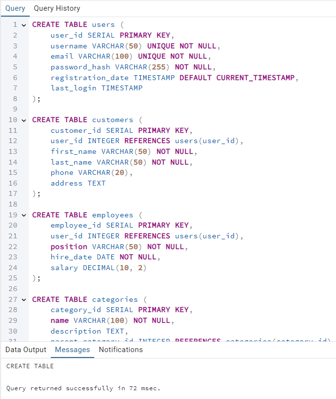
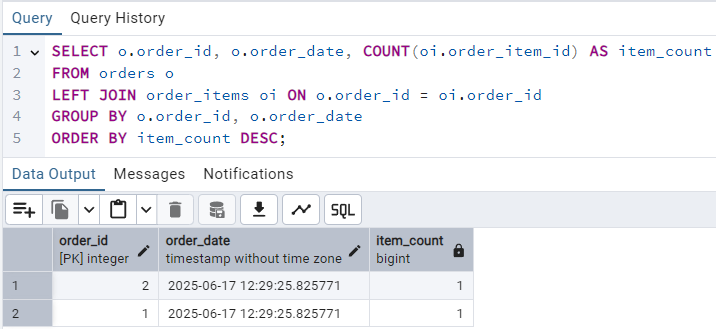
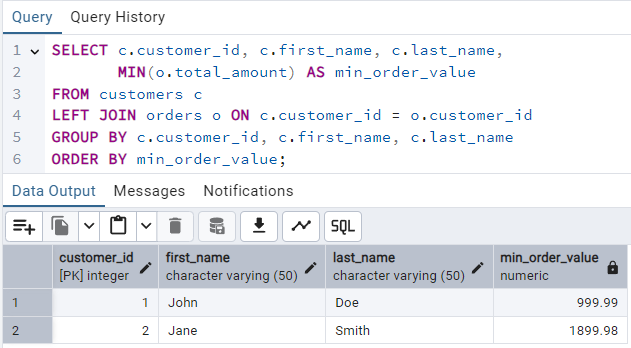

# Автоматик база данных
## Создание и заполнение таблиц:
Сначала мы создаём таблицы.
```sql
CREATE TABLE users (
    user_id SERIAL PRIMARY KEY,
    username VARCHAR(50) UNIQUE NOT NULL,
    email VARCHAR(100) UNIQUE NOT NULL,
    password_hash VARCHAR(255) NOT NULL,
    registration_date TIMESTAMP DEFAULT CURRENT_TIMESTAMP,
    last_login TIMESTAMP
);

CREATE TABLE customers (
    customer_id SERIAL PRIMARY KEY,
    user_id INTEGER REFERENCES users(user_id),
    first_name VARCHAR(50) NOT NULL,
    last_name VARCHAR(50) NOT NULL,
    phone VARCHAR(20),
    address TEXT
);

CREATE TABLE employees (
    employee_id SERIAL PRIMARY KEY,
    user_id INTEGER REFERENCES users(user_id),
    position VARCHAR(50) NOT NULL,
    hire_date DATE NOT NULL,
    salary DECIMAL(10, 2)
);

CREATE TABLE categories (
    category_id SERIAL PRIMARY KEY,
    name VARCHAR(100) NOT NULL,
    description TEXT,
    parent_category_id INTEGER REFERENCES categories(category_id)
);

CREATE TABLE products (
    product_id SERIAL PRIMARY KEY,
    category_id INTEGER REFERENCES categories(category_id),
    name VARCHAR(100) NOT NULL,
    description TEXT,
    price DECIMAL(10, 2) NOT NULL,
    stock_quantity INTEGER NOT NULL DEFAULT 0,
    manufacturer VARCHAR(100)
);

CREATE TABLE product_images (
    image_id SERIAL PRIMARY KEY,
    product_id INTEGER REFERENCES products(product_id),
    image_url VARCHAR(255) NOT NULL,
    is_primary BOOLEAN DEFAULT FALSE
);

CREATE TABLE product_specifications (
    spec_id SERIAL PRIMARY KEY,
    product_id INTEGER REFERENCES products(product_id),
    spec_name VARCHAR(100) NOT NULL,
    spec_value VARCHAR(255) NOT NULL
);

CREATE TABLE orders (
    order_id SERIAL PRIMARY KEY,
    customer_id INTEGER REFERENCES customers(customer_id),
    order_date TIMESTAMP DEFAULT CURRENT_TIMESTAMP,
    status VARCHAR(20) DEFAULT 'Pending',
    total_amount DECIMAL(10, 2)
);

CREATE TABLE order_items (
    order_item_id SERIAL PRIMARY KEY,
    order_id INTEGER REFERENCES orders(order_id),
    product_id INTEGER REFERENCES products(product_id),
    quantity INTEGER NOT NULL,
    unit_price DECIMAL(10, 2) NOT NULL
);

CREATE TABLE payments (
    payment_id SERIAL PRIMARY KEY,
    order_id INTEGER REFERENCES orders(order_id),
    amount DECIMAL(10, 2) NOT NULL,
    payment_date TIMESTAMP DEFAULT CURRENT_TIMESTAMP,
    payment_method VARCHAR(50)
);

CREATE TABLE shipping (
    shipping_id SERIAL PRIMARY KEY,
    order_id INTEGER REFERENCES orders(order_id),
    address TEXT NOT NULL,
    shipping_method VARCHAR(50),
    tracking_number VARCHAR(100),
    status VARCHAR(20) DEFAULT 'Processing'
);

CREATE TABLE reviews (
    review_id SERIAL PRIMARY KEY,
    product_id INTEGER REFERENCES products(product_id),
    customer_id INTEGER REFERENCES customers(customer_id),
    rating INTEGER NOT NULL CHECK (rating BETWEEN 1 AND 5),
    comment TEXT,
    review_date TIMESTAMP DEFAULT CURRENT_TIMESTAMP
);

CREATE TABLE discounts (
    discount_id SERIAL PRIMARY KEY,
    product_id INTEGER REFERENCES products(product_id),
    discount_percent DECIMAL(5, 2) NOT NULL,
    start_date DATE NOT NULL,
    end_date DATE NOT NULL
);

CREATE TABLE wishlists (
    wishlist_id SERIAL PRIMARY KEY,
    customer_id INTEGER REFERENCES customers(customer_id),
    product_id INTEGER REFERENCES products(product_id),
    added_date TIMESTAMP DEFAULT CURRENT_TIMESTAMP,
    UNIQUE(customer_id, product_id)
);

CREATE TABLE suppliers (
    supplier_id SERIAL PRIMARY KEY,
    name VARCHAR(100) NOT NULL,
    contact_person VARCHAR(100),
    phone VARCHAR(20),
    email VARCHAR(100)
);
```


Далее мы их заполняем.
```sql
INSERT INTO users (username, email, password_hash) VALUES 
('john_doe', 'john@example.com', 'hash1'),
('jane_smith', 'jane@example.com', 'hash2'),
('admin', 'admin@example.com', 'hash3');

INSERT INTO customers (user_id, first_name, last_name, phone, address) VALUES 
(1, 'John', 'Doe', '1234567890', '123 Main St'),
(2, 'Jane', 'Smith', '0987654321', '456 Oak Ave');

INSERT INTO employees (user_id, position, hire_date, salary) VALUES 
(3, 'Manager', '2020-01-15', 5000.00);

INSERT INTO categories (name, description, parent_category_id) VALUES 
('Electronics', 'All electronic devices', NULL),
('Computers', 'Computers and laptops', 1),
('Smartphones', 'Mobile phones', 1),
('Laptops', 'Portable computers', 2);

INSERT INTO products (category_id, name, description, price, stock_quantity, manufacturer) VALUES 
(3, 'iPhone 13', 'Apple smartphone', 999.99, 50, 'Apple'),
(3, 'Galaxy S21', 'Samsung smartphone', 899.99, 30, 'Samsung'),
(4, 'MacBook Pro', 'Apple laptop', 1999.99, 20, 'Apple'),
(4, 'ThinkPad X1', 'Lenovo laptop', 1499.99, 15, 'Lenovo');

INSERT INTO product_images (product_id, image_url, is_primary) VALUES 
(1, 'http://example.com/iphone1.jpg', TRUE),
(1, 'http://example.com/iphone2.jpg', FALSE),
(2, 'http://example.com/galaxy1.jpg', TRUE);

INSERT INTO product_specifications (product_id, spec_name, spec_value) VALUES 
(1, 'Storage', '128GB'),
(1, 'Color', 'Midnight'),
(2, 'Storage', '256GB'),
(2, 'Color', 'Phantom Black');

INSERT INTO orders (customer_id, status, total_amount) VALUES 
(1, 'Completed', 999.99),
(2, 'Processing', 1899.98);

INSERT INTO order_items (order_id, product_id, quantity, unit_price) VALUES 
(1, 1, 1, 999.99),
(2, 3, 1, 1999.99);

INSERT INTO payments (order_id, amount, payment_method) VALUES 
(1, 999.99, 'Credit Card'),
(2, 1899.98, 'PayPal');

INSERT INTO shipping (order_id, address, shipping_method, tracking_number, status) VALUES 
(1, '123 Main St', 'Express', 'TRACK123', 'Delivered'),
(2, '456 Oak Ave', 'Standard', 'TRACK456', 'In Transit');

INSERT INTO reviews (product_id, customer_id, rating, comment) VALUES 
(1, 1, 5, 'Excellent phone!'),
(3, 2, 4, 'Great laptop, but expensive');

INSERT INTO discounts (product_id, discount_percent, start_date, end_date) VALUES 
(2, 10.00, '2023-01-01', '2023-01-31'),
(4, 15.00, '2023-01-01', '2023-02-28');

INSERT INTO wishlists (customer_id, product_id) VALUES 
(1, 3),
(2, 1);

INSERT INTO suppliers (name, contact_person, phone, email) VALUES 
('Tech Supplier Inc', 'Mike Johnson', '5551234567', 'mike@techsupplier.com'),
('Gadget World', 'Sarah Lee', '5557654321', 'sarah@gadgetworld.com');
```


## Представления:
```sql
-- Обычное представление: заказы с информацией о клиентах
CREATE OR REPLACE VIEW order_customer_view AS
SELECT o.order_id, o.order_date, o.status, o.total_amount,
       c.first_name, c.last_name, u.email
FROM orders o
JOIN customers c ON o.customer_id = c.customer_id
JOIN users u ON c.user_id = u.user_id;

-- Материализованное представление: товары с рейтингом
CREATE MATERIALIZED VIEW product_ratings AS
SELECT p.product_id, p.name, 
       AVG(r.rating) AS avg_rating,
       COUNT(r.review_id) AS review_count
FROM products p
LEFT JOIN reviews r ON p.product_id = r.product_id
GROUP BY p.product_id, p.name;

-- Обычное представление: товары со скидками
CREATE VIEW discounted_products AS
SELECT p.product_id, p.name, p.price, 
       d.discount_percent,
       p.price * (1 - d.discount_percent/100) AS discounted_price
FROM products p
JOIN discounts d ON p.product_id = d.product_id
WHERE CURRENT_DATE BETWEEN d.start_date AND d.end_date;

-- Материализованное представление: продажи по категориям
CREATE MATERIALIZED VIEW category_sales AS
SELECT c.category_id, c.name,
       SUM(oi.quantity) AS total_quantity,
       SUM(oi.quantity * oi.unit_price) AS total_sales
FROM categories c
JOIN products p ON c.category_id = p.category_id
JOIN order_items oi ON p.product_id = oi.product_id
GROUP BY c.category_id, c.name;

-- Обычное представление: клиенты с их общей суммой покупок
CREATE VIEW customer_purchases AS
SELECT c.customer_id, c.first_name, c.last_name,
       COUNT(o.order_id) AS order_count,
       SUM(o.total_amount) AS total_spent
FROM customers c
LEFT JOIN orders o ON c.customer_id = o.customer_id
GROUP BY c.customer_id, c.first_name, c.last_name;
```


## 15 запросов с вложенностью
1. Товары, которые никогда не заказывали 
```sql
SELECT * FROM products
WHERE product_id NOT IN (SELECT product_id FROM order_items);
```


2. Клиенты, которые сделали заказы на сумму больше средней
```sql
SELECT * FROM customers
WHERE customer_id IN (
    SELECT customer_id FROM orders
    GROUP BY customer_id
    HAVING SUM(total_amount) > (SELECT AVG(total_amount) FROM orders)
);
```


3. Категории, в которых нет товаров  
```sql
SELECT * FROM categories
WHERE category_id NOT IN (SELECT DISTINCT category_id FROM products);
```


4. Товары с рейтингом выше среднего
```sql
SELECT * FROM products
WHERE product_id IN (
    SELECT product_id FROM reviews
    GROUP BY product_id
    HAVING AVG(rating) > (SELECT AVG(rating) FROM reviews)
);
```


5. Клиенты, которые добавили товар в список желаний, но не покупали его
```sql
SELECT c.customer_id, c.first_name, c.last_name
FROM customers c
WHERE EXISTS (
    SELECT 1 FROM wishlists w
    WHERE w.customer_id = c.customer_id
    AND NOT EXISTS (
        SELECT 1 FROM order_items oi
        JOIN orders o ON oi.order_id = o.order_id
        WHERE o.customer_id = c.customer_id
        AND oi.product_id = w.product_id
    )
);
```


6. Товары, которые есть в списках желаний, но нет в наличии
```sql
SELECT p.product_id, p.name
FROM products p
WHERE p.stock_quantity = 0
AND EXISTS (
    SELECT 1 FROM wishlists w
    WHERE w.product_id = p.product_id
);
```


7. Клиенты, которые не оставляли отзывов
```sql
SELECT * FROM customers
WHERE customer_id NOT IN (SELECT DISTINCT customer_id FROM reviews);
```


8. Категории с количеством товаров больше среднего
```sql
SELECT c.category_id, c.name, COUNT(p.product_id) AS product_count
FROM categories c
JOIN products p ON c.category_id = p.category_id
GROUP BY c.category_id, c.name
HAVING COUNT(p.product_id) > (
    SELECT AVG(cnt) FROM (
        SELECT COUNT(product_id) AS cnt
        FROM products
        GROUP BY category_id
    ) AS avg_counts
);
```


9. Заказы с количеством позиций больше среднего
```sql
SELECT o.order_id, o.order_date, COUNT(oi.order_item_id) AS item_count
FROM orders o
JOIN order_items oi ON o.order_id = oi.order_id
GROUP BY o.order_id, o.order_date
HAVING COUNT(oi.order_item_id) > (
    SELECT AVG(item_count) FROM (
        SELECT COUNT(order_item_id) AS item_count
        FROM order_items
        GROUP BY order_id
    ) AS avg_items
);
```


10. Товары, которые покупали все клиенты (гипотетический запрос)
```sql
SELECT p.product_id, p.name
FROM products p
WHERE NOT EXISTS (
    SELECT c.customer_id FROM customers c
    WHERE NOT EXISTS (
        SELECT 1 FROM order_items oi
        JOIN orders o ON oi.order_id = o.order_id
        WHERE oi.product_id = p.product_id
        AND o.customer_id = c.customer_id
    )
);
```


11. Клиенты, покупавшие товары из всех категорий (гипотетический запрос)
```sql
SELECT c.customer_id, c.first_name, c.last_name
FROM customers c
WHERE NOT EXISTS (
    SELECT cat.category_id FROM categories cat
    WHERE NOT EXISTS (
        SELECT 1 FROM order_items oi
        JOIN orders o ON oi.order_id = o.order_id
        JOIN products p ON oi.product_id = p.product_id
        WHERE o.customer_id = c.customer_id
        AND p.category_id = cat.category_id
    )
)
```


12. Товары, которые чаще всего добавляют в списки желаний
```sql
SELECT p.product_id, p.name, COUNT(w.wishlist_id) AS wishlist_count
FROM products p
JOIN wishlists w ON p.product_id = w.product_id
GROUP BY p.product_id, p.name
HAVING COUNT(w.wishlist_id) = (
    SELECT MAX(wish_count) FROM (
        SELECT COUNT(wishlist_id) AS wish_count
        FROM wishlists
        GROUP BY product_id
    ) AS max_wishes
);
```


13. Клиенты с максимальным количеством заказов
```sql
SELECT c.customer_id, c.first_name, c.last_name, COUNT(o.order_id) AS order_count
FROM customers c
JOIN orders o ON c.customer_id = o.customer_id
GROUP BY c.customer_id, c.first_name, c.last_name
HAVING COUNT(o.order_id) = (
    SELECT MAX(order_count) FROM (
        SELECT COUNT(order_id) AS order_count
        FROM orders
        GROUP BY customer_id
    ) AS max_orders
);
```


14. Категории с самым высоким средним рейтингом товаров
```sql
SELECT c.category_id, c.name, AVG(r.rating) AS avg_rating
FROM categories c
JOIN products p ON c.category_id = p.category_id
JOIN reviews r ON p.product_id = r.product_id
GROUP BY c.category_id, c.name
HAVING AVG(r.rating) = (
    SELECT MAX(avg_rating) FROM (
        SELECT AVG(rating) AS avg_rating
        FROM reviews
        JOIN products ON reviews.product_id = products.product_id
        GROUP BY category_id
    ) AS max_ratings
);
```


15. Товары, которые покупали вместе с данным товаром (для iPhone 13)
```sql
SELECT p.product_id, p.name, COUNT(*) AS times_bought_together
FROM products p
JOIN order_items oi ON p.product_id = oi.product_id
WHERE oi.order_id IN (
    SELECT order_id FROM order_items
    WHERE product_id = 1  -- iPhone 13
)
AND p.product_id != 1
GROUP BY p.product_id, p.name
ORDER BY times_bought_together DESC;
```


## 15 запросов с минимум 3 JOIN
1. Информация о заказах с деталями клиента, товарами и оплатой
```sql
SELECT o.order_id, o.order_date, o.status,
       c.first_name, c.last_name, u.email,
       p.name AS product_name, oi.quantity, oi.unit_price,
       py.amount AS payment_amount, py.payment_method
FROM orders o
JOIN customers c ON o.customer_id = c.customer_id
JOIN users u ON c.user_id = u.user_id
JOIN order_items oi ON o.order_id = oi.order_id
JOIN products p ON oi.product_id = p.product_id
LEFT JOIN payments py ON o.order_id = py.order_id;
```


2. Товары с их категориями, изображениями и характеристиками
```sql
SELECT p.product_id, p.name, p.price,
       c.name AS category_name,
       pi.image_url,
       ps.spec_name, ps.spec_value
FROM products p
JOIN categories c ON p.category_id = c.category_id
LEFT JOIN product_images pi ON p.product_id = pi.product_id
LEFT JOIN product_specifications ps ON p.product_id = ps.product_id
ORDER BY p.product_id;
```


3. Отзывы с информацией о товаре и клиенте
```sql
SELECT r.review_id, p.name AS product_name, 
       c.first_name, c.last_name, r.rating, r.comment, r.review_date
FROM reviews r
JOIN products p ON r.product_id = p.product_id
JOIN customers c ON r.customer_id = c.customer_id
ORDER BY r.review_date DESC;
```


4. Списки желаний с информацией о клиентах и товара
```sql
SELECT w.wishlist_id, 
       c.first_name, c.last_name, u.email,
       p.name AS product_name, p.price,
       cat.name AS category_name
FROM wishlists w
JOIN customers c ON w.customer_id = c.customer_id
JOIN users u ON c.user_id = u.user_id
JOIN products p ON w.product_id = p.product_id
JOIN categories cat ON p.category_id = cat.category_id
ORDER BY w.added_date DESC;
```


5. Доставка с информацией о заказе, клиенте и товарах
```sql
SELECT s.shipping_id, s.shipping_method, s.status, s.tracking_number,
       o.order_date, o.total_amount,
       c.first_name, c.last_name, c.address,
       STRING_AGG(p.name, ', ') AS products
FROM shipping s
JOIN orders o ON s.order_id = o.order_id
JOIN customers c ON o.customer_id = c.customer_id
JOIN order_items oi ON o.order_id = oi.order_id
JOIN products p ON oi.product_id = p.product_id
GROUP BY s.shipping_id, s.shipping_method, s.status, s.tracking_number,
         o.order_date, o.total_amount, c.first_name, c.last_name, c.address;
```


6. Товары со скидками и их категориями
```sql
SELECT p.product_id, p.name, p.price,
       d.discount_percent,
       p.price * (1 - d.discount_percent/100) AS discounted_price,
       c.name AS category_name,
       c.parent_category_id
FROM products p
JOIN discounts d ON p.product_id = d.product_id
JOIN categories c ON p.category_id = c.category_id
WHERE CURRENT_DATE BETWEEN d.start_date AND d.end_date;
```


7. Клиенты с их заказами, товарами и отзывами
```sql
SELECT c.customer_id, c.first_name, c.last_name,
       o.order_id, o.order_date, o.status,
       p.name AS product_name, oi.quantity,
       r.rating, r.comment AS review
FROM customers c
LEFT JOIN orders o ON c.customer_id = o.customer_id
LEFT JOIN order_items oi ON o.order_id = oi.order_id
LEFT JOIN products p ON oi.product_id = p.product_id
LEFT JOIN reviews r ON p.product_id = r.product_id AND r.customer_id = c.customer_id
ORDER BY c.last_name, c.first_name, o.order_date DESC;
```


8. Иерархия категорий с количеством товаров
```sql
WITH RECURSIVE category_hierarchy AS (
    SELECT category_id, name, parent_category_id, 1 AS level
    FROM categories
    WHERE parent_category_id IS NULL
    
    UNION ALL
    
    SELECT c.category_id, c.name, c.parent_category_id, ch.level + 1
    FROM categories c
    JOIN category_hierarchy ch ON c.parent_category_id = ch.category_id
)
SELECT ch.category_id, ch.name, 
       COALESCE(p.parent_name, 'Top Level') AS parent_category,
       ch.level,
       COUNT(p.product_id) AS product_count
FROM category_hierarchy ch
LEFT JOIN (
    SELECT p.product_id, p.category_id, c.name AS parent_name
    FROM products p
    JOIN categories c ON p.category_id = c.category_id
) p ON ch.category_id = p.category_id
GROUP BY ch.category_id, ch.name, p.parent_name, ch.level
ORDER BY ch.level, ch.name;
```


9. Поставщики и их товары с категориями
```sql
SELECT s.supplier_id, s.name AS supplier_name,
       p.product_id, p.name AS product_name, p.price,
       c.name AS category_name
FROM products p
JOIN categories c ON p.category_id = c.category_id
JOIN suppliers s ON p.manufacturer = s.name
ORDER BY s.name, p.name;
```


10. Анализ продаж по категориям и клиентам
```sql
SELECT c.customer_id, c.first_name, c.last_name,
       cat.category_id, cat.name AS category_name,
       COUNT(oi.order_item_id) AS items_purchased,
       SUM(oi.quantity * oi.unit_price) AS total_spent
FROM customers c
JOIN orders o ON c.customer_id = o.customer_id
JOIN order_items oi ON o.order_id = oi.order_id
JOIN products p ON oi.product_id = p.product_id
JOIN categories cat ON p.category_id = cat.category_id
GROUP BY c.customer_id, c.first_name, c.last_name, cat.category_id, cat.name
ORDER BY total_spent DESC;
```


11. Товары с их рейтингами и количеством в списках желаний
```sql
SELECT p.product_id, p.name, p.price,
       ROUND(AVG(r.rating), 2) AS avg_rating,
       COUNT(DISTINCT r.review_id) AS review_count,
       COUNT(DISTINCT w.wishlist_id) AS wishlist_count
FROM products p
LEFT JOIN reviews r ON p.product_id = r.product_id
LEFT JOIN wishlists w ON p.product_id = w.product_id
GROUP BY p.product_id, p.name, p.price
ORDER BY avg_rating DESC NULLS LAST;
```


12. Полная информация о заказах для отчетов
```sql
SELECT o.order_id, o.order_date, o.status, o.total_amount,
       c.first_name, c.last_name, u.email, c.phone,
       STRING_AGG(p.name || ' (x' || oi.quantity || ')', ', ') AS products,
       py.payment_method, py.amount AS payment_amount,
       s.shipping_method, s.tracking_number, s.status AS shipping_status
FROM orders o
JOIN customers c ON o.customer_id = c.customer_id
JOIN users u ON c.user_id = u.user_id
JOIN order_items oi ON o.order_id = oi.order_id
JOIN products p ON oi.product_id = p.product_id
LEFT JOIN payments py ON o.order_id = py.order_id
LEFT JOIN shipping s ON o.order_id = s.order_id
GROUP BY o.order_id, o.order_date, o.status, o.total_amount,
         c.first_name, c.last_name, u.email, c.phone,
         py.payment_method, py.amount,
         s.shipping_method, s.tracking_number, s.status;
```


13. Анализ товаров: продажи, отзывы, списки желаний
```sql
SELECT p.product_id, p.name, p.price,
       cat.name AS category_name,
       COUNT(DISTINCT oi.order_item_id) AS times_ordered,
       SUM(oi.quantity) AS total_quantity_sold,
       SUM(oi.quantity * oi.unit_price) AS total_revenue,
       ROUND(AVG(r.rating), 2) AS avg_rating,
       COUNT(DISTINCT w.wishlist_id) AS wishlist_count
FROM products p
JOIN categories cat ON p.category_id = cat.category_id
LEFT JOIN order_items oi ON p.product_id = oi.product_id
LEFT JOIN reviews r ON p.product_id = r.product_id
LEFT JOIN wishlists w ON p.product_id = w.product_id
GROUP BY p.product_id, p.name, p.price, cat.name
ORDER BY total_revenue DESC NULLS LAST;
```


14. Клиенты и их активность (заказы, отзывы, списки желаний)
```sql
SELECT c.customer_id, c.first_name, c.last_name, u.email,
       COUNT(DISTINCT o.order_id) AS order_count,
       SUM(o.total_amount) AS total_spent,
       COUNT(DISTINCT r.review_id) AS review_count,
       COUNT(DISTINCT w.wishlist_id) AS wishlist_count,
       MAX(o.order_date) AS last_order_date
FROM customers c
JOIN users u ON c.user_id = u.user_id
LEFT JOIN orders o ON c.customer_id = o.customer_id
LEFT JOIN reviews r ON c.customer_id = r.customer_id
LEFT JOIN wishlists w ON c.customer_id = w.customer_id
GROUP BY c.customer_id, c.first_name, c.last_name, u.email
ORDER BY total_spent DESC NULLS LAST;
```


15. Анализ скидок: эффективность по товарам
```sql
SELECT p.product_id, p.name, p.price,
       d.discount_percent,
       p.price * (1 - d.discount_percent/100) AS discounted_price,
       COUNT(oi.order_item_id) AS times_ordered_with_discount,
       SUM(oi.quantity) AS total_quantity_sold,
       SUM(oi.quantity * oi.unit_price) AS total_revenue,
       cat.name AS category_name
FROM products p
JOIN discounts d ON p.product_id = d.product_id
JOIN categories cat ON p.category_id = cat.category_id
LEFT JOIN order_items oi ON p.product_id = oi.product_id
LEFT JOIN orders o ON oi.order_id = o.order_id
WHERE o.order_date BETWEEN d.start_date AND d.end_date
GROUP BY p.product_id, p.name, p.price, d.discount_percent, cat.name
ORDER BY total_quantity_sold DESC;
```


## 10 запросов на каждую из 5 агрегатных функций
### COUNT

1. Количество заказов для каждого клиента
```sql
SELECT c.customer_id, c.first_name, c.last_name, COUNT(o.order_id) AS order_count
FROM customers c
LEFT JOIN orders o ON c.customer_id = o.customer_id
GROUP BY c.customer_id, c.first_name, c.last_name
ORDER BY order_count DESC;
```


2. Количество товаров в каждой категории
```sql
SELECT c.category_id, c.name, COUNT(p.product_id) AS product_count
FROM categories c
LEFT JOIN products p ON c.category_id = p.category_id
GROUP BY c.category_id, c.name
ORDER BY product_count DESC;
```


3. Количество отзывов для каждого товара
```sql
SELECT p.product_id, p.name, COUNT(r.review_id) AS review_count
FROM products p
LEFT JOIN reviews r ON p.product_id = r.product_id
GROUP BY p.product_id, p.name
ORDER BY review_count DESC;
```


4. Количество товаров в каждом заказе
```sql
SELECT o.order_id, o.order_date, COUNT(oi.order_item_id) AS item_count
FROM orders o
LEFT JOIN order_items oi ON o.order_id = oi.order_id
GROUP BY o.order_id, o.order_date
ORDER BY item_count DESC;
```


5. Количество клиентов, купивших каждый товар
```sql
SELECT p.product_id, p.name, COUNT(DISTINCT o.customer_id) AS customer_count
FROM products p
LEFT JOIN order_items oi ON p.product_id = oi.product_id
LEFT JOIN orders o ON oi.order_id = o.order_id
GROUP BY p.product_id, p.name
ORDER BY customer_count DESC;
```


6. Количество изображений для каждого товара
```sql
SELECT p.product_id, p.name, COUNT(pi.image_id) AS image_count
FROM products p
LEFT JOIN product_images pi ON p.product_id = pi.product_id
GROUP BY p.product_id, p.name
ORDER BY image_count DESC;
```


7. Количество характеристик для каждого товара
```sql
SELECT p.product_id, p.name, COUNT(ps.spec_id) AS spec_count
FROM products p
LEFT JOIN product_specifications ps ON p.product_id = ps.product_id
GROUP BY p.product_id, p.name
ORDER BY spec_count DESC;
```


8. Количество товаров в списках желаний по категориям
```sql
SELECT c.category_id, c.name, COUNT(w.wishlist_id) AS wishlist_count
FROM categories c
LEFT JOIN products p ON c.category_id = p.category_id
LEFT JOIN wishlists w ON p.product_id = w.product_id
GROUP BY c.category_id, c.name
ORDER BY wishlist_count DESC;
```


9. Количество активных скидок на текущий момент
```sql
SELECT COUNT(*) AS active_discounts
FROM discounts
WHERE CURRENT_DATE BETWEEN start_date AND end_date;
```


10. Количество заказов по статусам
```sql
SELECT status, COUNT(order_id) AS order_count
FROM orders
GROUP BY status
ORDER BY order_count DESC;
```


### SUM

1. Общая сумма продаж по каждому клиенту
```sql
SELECT c.customer_id, c.first_name, c.last_name, SUM(o.total_amount) AS total_spent
FROM customers c
LEFT JOIN orders o ON c.customer_id = o.customer_id
GROUP BY c.customer_id, c.first_name, c.last_name
ORDER BY total_spent DESC NULLS LAST;
```


2. Общая выручка по каждому товару
```sql
SELECT p.product_id, p.name, SUM(oi.quantity * oi.unit_price) AS total_revenue
FROM products p
LEFT JOIN order_items oi ON p.product_id = oi.product_id
GROUP BY p.product_id, p.name
ORDER BY total_revenue DESC NULLS LAST;
```


3. Общая сумма платежей по каждому методу оплаты
```sql
SELECT payment_method, SUM(amount) AS total_payments
FROM payments
GROUP BY payment_method
ORDER BY total_payments DESC;
```


4. Общая сумма скидок по каждому товару
```sql
SELECT p.product_id, p.name, 
       SUM(p.price * d.discount_percent/100 * oi.quantity) AS total_discount
FROM products p
JOIN discounts d ON p.product_id = d.product_id
JOIN order_items oi ON p.product_id = oi.product_id
JOIN orders o ON oi.order_id = o.order_id
WHERE o.order_date BETWEEN d.start_date AND d.end_date
GROUP BY p.product_id, p.name
ORDER BY total_discount DESC;
```


5. Общая стоимость товаров в списках желаний по клиентам
```sql
SELECT c.customer_id, c.first_name, c.last_name, 
       SUM(p.price) AS wishlist_total
FROM customers c
JOIN wishlists w ON c.customer_id = w.customer_id
JOIN products p ON w.product_id = p.product_id
GROUP BY c.customer_id, c.first_name, c.last_name
ORDER BY wishlist_total DESC;
```


6. Общая сумма продаж по категориям
```sql
SELECT c.category_id, c.name, 
       SUM(oi.quantity * oi.unit_price) AS category_revenue
FROM categories c
LEFT JOIN products p ON c.category_id = p.category_id
LEFT JOIN order_items oi ON p.product_id = oi.product_id
GROUP BY c.category_id, c.name
ORDER BY category_revenue DESC NULLS LAST;
```


7. Общая сумма продаж по месяцам
```sql
SELECT DATE_TRUNC('month', order_date) AS month,
       SUM(total_amount) AS monthly_revenue
FROM orders
GROUP BY DATE_TRUNC('month', order_date)
ORDER BY month;
```


8. Общая стоимость товаров на складе по категориям
```sql
SELECT c.category_id, c.name, 
       SUM(p.price * p.stock_quantity) AS stock_value
FROM categories c
LEFT JOIN products p ON c.category_id = p.category_id
GROUP BY c.category_id, c.name
ORDER BY stock_value DESC NULLS LAST;
```


9. Общая сумма заказов по статусам доставки
```sql
SELECT s.status, SUM(o.total_amount) AS total_amount
FROM shipping s
JOIN orders o ON s.order_id = o.order_id
GROUP BY s.status
ORDER BY total_amount DESC;
```


10. Общая выручка по производителям
```sql
SELECT manufacturer, SUM(oi.quantity * oi.unit_price) AS manufacturer_revenue
FROM products p
JOIN order_items oi ON p.product_id = oi.product_id
GROUP BY manufacturer
ORDER BY manufacturer_revenue DESC;
```


### AVG

1. Средний чек заказа
```sql
SELECT AVG(total_amount) AS avg_order_value FROM orders;
```


2. Средний рейтинг товаров по категориям
```sql
SELECT c.category_id, c.name, AVG(r.rating) AS avg_rating
FROM categories c
LEFT JOIN products p ON c.category_id = p.category_id
LEFT JOIN reviews r ON p.product_id = r.product_id
GROUP BY c.category_id, c.name
ORDER BY avg_rating DESC NULLS LAST;
```


3. Среднее количество товаров в заказе
```sql
SELECT AVG(item_count) AS avg_items_per_order
FROM (
    SELECT COUNT(order_item_id) AS item_count
    FROM order_items
    GROUP BY order_id
) AS order_items_count;
```


4. Средняя цена товара по категориям
```sql
SELECT c.category_id, c.name, AVG(p.price) AS avg_price
FROM categories c
LEFT JOIN products p ON c.category_id = p.category_id
GROUP BY c.category_id, c.name
ORDER BY avg_price DESC NULLS LAST;
```


5. Средний размер скидки
```sql
SELECT AVG(discount_percent) AS avg_discount FROM discounts;
```


6. Среднее время между заказом и оплатой
```sql
SELECT AVG(payment_date - order_date) AS avg_payment_time
FROM orders o
JOIN payments p ON o.order_id = p.order_id;
```


7. Среднее количество отзывов на товар
```sql
SELECT AVG(review_count) AS avg_reviews_per_product
FROM (
    SELECT COUNT(review_id) AS review_count
    FROM reviews
    GROUP BY product_id
) AS product_reviews;
```


8. Средняя оценка товаров каждого производителя
```sql
SELECT manufacturer, AVG(r.rating) AS avg_rating
FROM products p
LEFT JOIN reviews r ON p.product_id = r.product_id
GROUP BY manufacturer
ORDER BY avg_rating DESC NULLS LAST;
```


9. Средняя стоимость товаров в списках желаний по клиентам
```sql
SELECT c.customer_id, c.first_name, c.last_name, 
       AVG(p.price) AS avg_wishlist_item_price
FROM customers c
JOIN wishlists w ON c.customer_id = w.customer_id
JOIN products p ON w.product_id = p.product_id
GROUP BY c.customer_id, c.first_name, c.last_name
ORDER BY avg_wishlist_item_price DESC;
```


10. Среднее время доставки (разница между датой заказа и датой доставки)
```sql
SELECT AVG(delivery_time) AS avg_delivery_time
FROM (
    SELECT (NOW()::date - o.order_date::date) AS delivery_time
    FROM orders o
    JOIN shipping s ON o.order_id = s.order_id
    WHERE s.status = 'Delivered'
) AS delivery_times;
```


### MIN

1. Минимальная цена товара в каждой категории
```sql
SELECT c.category_id, c.name, MIN(p.price) AS min_price
FROM categories c
LEFT JOIN products p ON c.category_id = p.category_id
GROUP BY c.category_id, c.name
ORDER BY min_price;
```


2. Самый дешевый заказ каждого клиента
```sql
SELECT c.customer_id, c.first_name, c.last_name, 
       MIN(o.total_amount) AS min_order_value
FROM customers c
LEFT JOIN orders o ON c.customer_id = o.customer_id
GROUP BY c.customer_id, c.first_name, c.last_name
ORDER BY min_order_value;
```


3. Самая ранняя дата заказа
```sql
SELECT MIN(order_date) AS first_order_date FROM orders;
```


4. Товар с минимальным количеством на складе
```sql
SELECT product_id, name, stock_quantity
FROM products
WHERE stock_quantity = (SELECT MIN(stock_quantity) FROM products);
```


5. Минимальный рейтинг товара по категориям
```sql
SELECT c.category_id, c.name, MIN(r.rating) AS min_rating
FROM categories c
LEFT JOIN products p ON c.category_id = p.category_id
LEFT JOIN reviews r ON p.product_id = r.product_id
GROUP BY c.category_id, c.name
ORDER BY min_rating;
```


6. Минимальная скидка
```sql
SELECT MIN(discount_percent) AS min_discount FROM discounts;
```


7. Самый дешевый товар в списках желаний по клиентам
```sql
SELECT c.customer_id, c.first_name, c.last_name, 
       MIN(p.price) AS cheapest_wishlist_item
FROM customers c
JOIN wishlists w ON c.customer_id = w.customer_id
JOIN products p ON w.product_id = p.product_id
GROUP BY c.customer_id, c.first_name, c.last_name
ORDER BY cheapest_wishlist_item;
```


8. Минимальное количество товаров в заказе
```sql
SELECT MIN(item_count) AS min_items_per_order
FROM (
    SELECT COUNT(order_item_id) AS item_count
    FROM order_items
    GROUP BY order_id
) AS order_items_count;
```


9. Самая ранняя дата отзыва для каждого товара
```sql
SELECT p.product_id, p.name, MIN(r.review_date) AS first_review_date
FROM products p
LEFT JOIN reviews r ON p.product_id = r.product_id
GROUP BY p.product_id, p.name
ORDER BY first_review_date NULLS LAST;
```


10. Минимальное время между заказом и оплатой
```sql
SELECT MIN(payment_date - order_date) AS min_payment_time
FROM orders o
JOIN payments p ON o.order_id = p.order_id;
```


### MAX

1. Максимальная цена товара в каждой категории
```sql
SELECT c.category_id, c.name, MAX(p.price) AS max_price
FROM categories c
LEFT JOIN products p ON c.category_id = p.category_id
GROUP BY c.category_id, c.name
ORDER BY max_price DESC;
```


2. Самый дорогой заказ каждого клиента
```sql
SELECT c.customer_id, c.first_name, c.last_name, 
       MAX(o.total_amount) AS max_order_value
FROM customers c
LEFT JOIN orders o ON c.customer_id = o.customer_id
GROUP BY c.customer_id, c.first_name, c.last_name
ORDER BY max_order_value DESC NULLS LAST;
```


3. Самая поздняя дата заказа
```sql
SELECT MAX(order_date) AS last_order_date FROM orders;
```


4. Товар с максимальным количеством на складе
```sql
SELECT product_id, name, stock_quantity
FROM products
WHERE stock_quantity = (SELECT MAX(stock_quantity) FROM products);
```


5. Максимальный рейтинг товара по категориям
```sql
SELECT c.category_id, c.name, MAX(r.rating) AS max_rating
FROM categories c
LEFT JOIN products p ON c.category_id = p.category_id
LEFT JOIN reviews r ON p.product_id = r.product_id
GROUP BY c.category_id, c.name
ORDER BY max_rating DESC NULLS LAST;
```


6. Максимальная скидка
```sql
SELECT MAX(discount_percent) AS max_discount FROM discounts;
```


7. Самый дорогой товар в списках желаний по клиентам
```sql
SELECT c.customer_id, c.first_name, c.last_name, 
       MAX(p.price) AS most_expensive_wishlist_item
FROM customers c
JOIN wishlists w ON c.customer_id = w.customer_id
JOIN products p ON w.product_id = p.product_id
GROUP BY c.customer_id, c.first_name, c.last_name
ORDER BY most_expensive_wishlist_item DESC;
```


8. Максимальное количество товаров в заказе
```sql
SELECT MAX(item_count) AS max_items_per_order
FROM (
    SELECT COUNT(order_item_id) AS item_count
    FROM order_items
    GROUP BY order_id
) AS order_items_count;
```


9. Самая поздняя дата отзыва для каждого товара
```sql
SELECT p.product_id, p.name, MAX(r.review_date) AS last_review_date
FROM products p
LEFT JOIN reviews r ON p.product_id = r.product_id
GROUP BY p.product_id, p.name
ORDER BY last_review_date DESC NULLS LAST;
```


10. Максимальное время между заказом и оплатой
```sql
SELECT MAX(payment_date - order_date) AS max_payment_time
FROM orders o
JOIN payments p ON o.order_id = p.order_id;
```


## 5 хранимых процедур
1. Процедура для оформления нового заказа
```sql
CREATE OR REPLACE PROCEDURE place_order(
    p_customer_id INT,
    p_product_ids INT[],
    p_quantities INT[],
    OUT p_order_id INT
)
LANGUAGE plpgsql
AS $$
DECLARE
    i INT;
    v_total DECIMAL(10, 2) := 0;
    v_price DECIMAL(10, 2);
BEGIN
    -- Проверка, что количество товаров соответствует количеству количеств
    IF array_length(p_product_ids, 1) != array_length(p_quantities, 1) THEN
        RAISE EXCEPTION 'Количество товаров и количеств не совпадает';
    END IF;
    
    -- Создание заказа
    INSERT INTO orders (customer_id, status, total_amount)
    VALUES (p_customer_id, 'Pending', 0)
    RETURNING order_id INTO p_order_id;
    
    -- Добавление товаров в заказ
    FOR i IN 1..array_length(p_product_ids, 1) LOOP
        -- Получение цены товара
        SELECT price INTO v_price FROM products WHERE product_id = p_product_ids[i];
        
        -- Добавление позиции в заказ
        INSERT INTO order_items (order_id, product_id, quantity, unit_price)
        VALUES (p_order_id, p_product_ids[i], p_quantities[i], v_price);
        
        -- Обновление общей суммы
        v_total := v_total + (v_price * p_quantities[i]);
        
        -- Уменьшение количества товара на складе
        UPDATE products 
        SET stock_quantity = stock_quantity - p_quantities[i]
        WHERE product_id = p_product_ids[i];
    END LOOP;
    
    -- Обновление общей суммы заказа
    UPDATE orders SET total_amount = v_total WHERE order_id = p_order_id;
    
    COMMIT;
END;
$$;
```


2. Процедура для обработки платежа
```sql
CREATE OR REPLACE PROCEDURE process_payment(
    p_order_id INT,
    p_amount DECIMAL(10, 2),
    p_payment_method VARCHAR(50)
)
LANGUAGE plpgsql
AS $$
DECLARE
    v_order_total DECIMAL(10, 2);
    v_order_status VARCHAR(20);
BEGIN
    -- Получение суммы и статуса заказа
    SELECT total_amount, status INTO v_order_total, v_order_status
    FROM orders WHERE order_id = p_order_id;
    
    -- Проверка существования заказа
    IF NOT FOUND THEN
        RAISE EXCEPTION 'Заказ с ID % не найден', p_order_id;
    END IF;
    
    -- Проверка статуса заказа
    IF v_order_status != 'Pending' THEN
        RAISE EXCEPTION 'Заказ уже обработан (статус: %)', v_order_status;
    END IF;
    
    -- Проверка суммы платежа
    IF p_amount < v_order_total THEN
        RAISE EXCEPTION 'Сумма платежа (%) меньше суммы заказа (%)', p_amount, v_order_total;
    END IF;
    
    -- Добавление платежа
    INSERT INTO payments (order_id, amount, payment_method)
    VALUES (p_order_id, p_amount, p_payment_method);
    
    -- Обновление статуса заказа
    UPDATE orders SET status = 'Paid' WHERE order_id = p_order_id;
    
    COMMIT;
END;
$$;
```


3. Процедура для обновления рейтинга товара
```sql
CREATE OR REPLACE PROCEDURE update_product_rating(p_product_id INT)
LANGUAGE plpgsql
AS $$
DECLARE
    v_avg_rating DECIMAL(3, 2);
    v_review_count INT;
BEGIN
    -- Получение среднего рейтинга и количества отзывов
    SELECT AVG(rating), COUNT(*) INTO v_avg_rating, v_review_count
    FROM reviews
    WHERE product_id = p_product_id;
    -- выводим информацию
    RAISE NOTICE 'Товар ID %: средний рейтинг %, отзывов %', 
        p_product_id, COALESCE(v_avg_rating, 0), COALESCE(v_review_count, 0);
END;
$$;
```


4. Процедура для применения скидки к категории товаров
```sql
CREATE OR REPLACE PROCEDURE apply_category_discount(
    p_category_id INT,
    p_discount_percent DECIMAL(5, 2),
    p_start_date DATE,
    p_end_date DATE
)
LANGUAGE plpgsql
AS $$
BEGIN
    -- Проверка корректности скидки
    IF p_discount_percent <= 0 OR p_discount_percent >= 100 THEN
        RAISE EXCEPTION 'Неверный процент скидки (должен быть между 0 и 100)';
    END IF;
    
    -- Проверка дат
    IF p_start_date >= p_end_date THEN
        RAISE EXCEPTION 'Дата начала должна быть раньше даты окончания';
    END IF;
    
    -- Удаление старых скидок для этих товаров в этом периоде
    DELETE FROM discounts
    WHERE product_id IN (SELECT product_id FROM products WHERE category_id = p_category_id)
    AND (start_date, end_date) OVERLAPS (p_start_date, p_end_date);
    
    -- Добавление новых скидок
    INSERT INTO discounts (product_id, discount_percent, start_date, end_date)
    SELECT product_id, p_discount_percent, p_start_date, p_end_date
    FROM products
    WHERE category_id = p_category_id;
    
    RAISE NOTICE 'Скидка %%% применена к % товарам категории ID %', 
        p_discount_percent, ROW_COUNT, p_category_id;
    
    COMMIT;
END;
$$;
```


5. Процедура для генерации отчета по продажам за период
```sql
CREATE OR REPLACE PROCEDURE generate_sales_report(
    p_start_date DATE,
    p_end_date DATE,
    OUT p_total_orders INT,
    OUT p_total_revenue DECIMAL(12, 2),
    OUT p_avg_order_value DECIMAL(10, 2),
    OUT p_top_product_id INT,
    OUT p_top_product_name VARCHAR(100),
    OUT p_top_product_qty INT
)
LANGUAGE plpgsql
AS $$
BEGIN
    -- Общее количество заказов
    SELECT COUNT(*) INTO p_total_orders
    FROM orders
    WHERE order_date BETWEEN p_start_date AND p_end_date;
    
    -- Общая выручка
    SELECT COALESCE(SUM(total_amount), 0) INTO p_total_revenue
    FROM orders
    WHERE order_date BETWEEN p_start_date AND p_end_date;
    
    -- Средний чек
    SELECT COALESCE(AVG(total_amount), 0) INTO p_avg_order_value
    FROM orders
    WHERE order_date BETWEEN p_start_date AND p_end_date;
    
    -- Самый продаваемый товар
    SELECT p.product_id, p.name, SUM(oi.quantity) INTO 
        p_top_product_id, p_top_product_name, p_top_product_qty
    FROM order_items oi
    JOIN products p ON oi.product_id = p.product_id
    JOIN orders o ON oi.order_id = o.order_id
    WHERE o.order_date BETWEEN p_start_date AND p_end_date
    GROUP BY p.product_id, p.name
    ORDER BY SUM(oi.quantity) DESC
    LIMIT 1;
    
    IF NOT FOUND THEN
        p_top_product_id := NULL;
        p_top_product_name := 'Нет данных';
        p_top_product_qty := 0;
    END IF;
    
    RAISE NOTICE 'Отчет сгенерирован за период с % по %', p_start_date, p_end_date;
END;
$$;
```


## Триггеры для таблиц products и order_items

1. Триггеры для таблицы products
```sql
-- BEFORE INSERT: проверка цены и количества
CREATE OR REPLACE FUNCTION check_product_before_insert()
RETURNS TRIGGER
LANGUAGE plpgsql
AS $$
BEGIN
    IF NEW.price <= 0 THEN
        RAISE EXCEPTION 'Цена товара должна быть положительной';
    END IF;
    
    IF NEW.stock_quantity < 0 THEN
        RAISE EXCEPTION 'Количество товара не может быть отрицательным';
    END IF;
    
    RETURN NEW;
END;
$$;

CREATE TRIGGER products_before_insert
BEFORE INSERT ON products
FOR EACH ROW
EXECUTE FUNCTION check_product_before_insert();

-- BEFORE UPDATE: те же проверки + логирование изменений цены
CREATE OR REPLACE FUNCTION check_product_before_update()
RETURNS TRIGGER
LANGUAGE plpgsql
AS $$
BEGIN
    IF NEW.price <= 0 THEN
        RAISE EXCEPTION 'Цена товара должна быть положительной';
    END IF;
    
    IF NEW.stock_quantity < 0 THEN
        RAISE EXCEPTION 'Количество товара не может быть отрицательным';
    END IF;
    
    -- Логирование изменения цены
    IF NEW.price != OLD.price THEN
        RAISE NOTICE 'Изменение цены товара ID %: с % на %', 
            NEW.product_id, OLD.price, NEW.price;
    END IF;
    
    RETURN NEW;
END;
$$;

CREATE TRIGGER products_before_update
BEFORE UPDATE ON products
FOR EACH ROW
EXECUTE FUNCTION check_product_before_update();

-- AFTER DELETE: логирование удаления товара
CREATE OR REPLACE FUNCTION log_product_deletion()
RETURNS TRIGGER
LANGUAGE plpgsql
AS $$
BEGIN
    RAISE NOTICE 'Удален товар ID %, название: %, категория: %', 
        OLD.product_id, OLD.name, OLD.category_id;
    RETURN OLD;
END;
$$;

CREATE TRIGGER products_after_delete
AFTER DELETE ON products
FOR EACH ROW
EXECUTE FUNCTION log_product_deletion();
```


2. Триггеры для таблицы order_items
```sql
-- BEFORE INSERT: проверка количества и обновление цены
CREATE OR REPLACE FUNCTION check_order_item_before_insert()
RETURNS TRIGGER
LANGUAGE plpgsql
AS $$
DECLARE
    v_price DECIMAL(10, 2);
    v_stock INT;
BEGIN
    -- Получение текущей цены и количества товара
    SELECT price, stock_quantity INTO v_price, v_stock
    FROM products
    WHERE product_id = NEW.product_id;
    
    -- Проверка наличия товара
    IF v_stock < NEW.quantity THEN
        RAISE EXCEPTION 'Недостаточно товара на складе (доступно: %, запрошено: %)', 
            v_stock, NEW.quantity;
    END IF;
    
    -- Установка цены на момент заказа
    NEW.unit_price := v_price;
    
    RETURN NEW;
END;
$$;

CREATE TRIGGER order_items_before_insert
BEFORE INSERT ON order_items
FOR EACH ROW
EXECUTE FUNCTION check_order_item_before_insert();

-- BEFORE UPDATE: запрет изменения заказа
CREATE OR REPLACE FUNCTION prevent_order_item_update()
RETURNS TRIGGER
LANGUAGE plpgsql
AS $$
BEGIN
    RAISE EXCEPTION 'Изменение позиций заказа запрещено';
    RETURN NULL;
END;
$$;

CREATE TRIGGER order_items_before_update
BEFORE UPDATE ON order_items
FOR EACH ROW
EXECUTE FUNCTION prevent_order_item_update();

-- AFTER DELETE: обновление общего количества заказа
CREATE OR REPLACE FUNCTION update_order_after_item_delete()
RETURNS TRIGGER
LANGUAGE plpgsql
AS $$
BEGIN
    -- Обновление общей суммы заказа
    UPDATE orders
    SET total_amount = total_amount - (OLD.quantity * OLD.unit_price)
    WHERE order_id = OLD.order_id;
    
    -- Возврат товара на склад
    UPDATE products
    SET stock_quantity = stock_quantity + OLD.quantity
    WHERE product_id = OLD.product_id;
    
    RETURN OLD;
END;
$$;

CREATE TRIGGER order_items_after_delete
AFTER DELETE ON order_items
FOR EACH ROW
EXECUTE FUNCTION update_order_after_item_delete();
```

